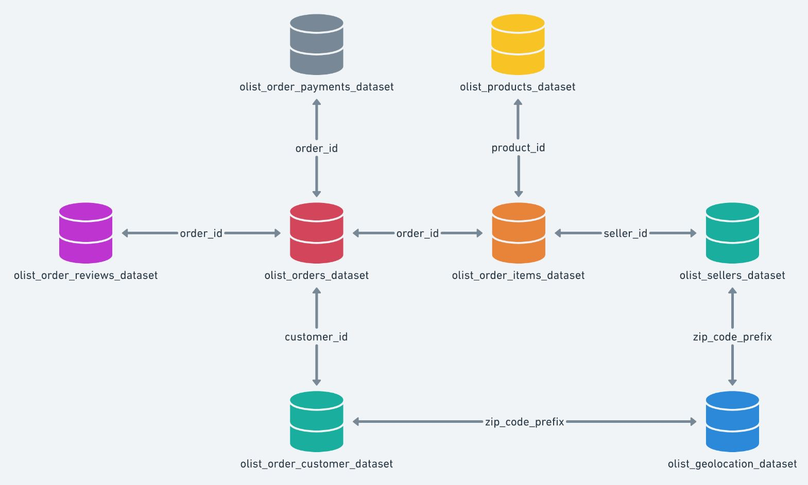
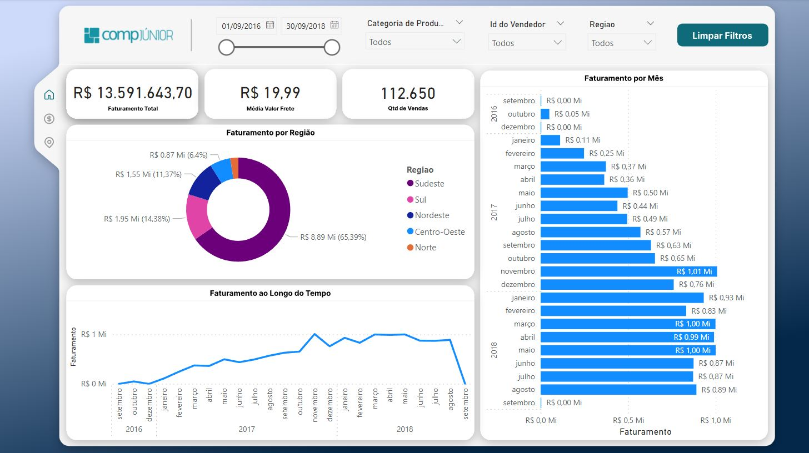
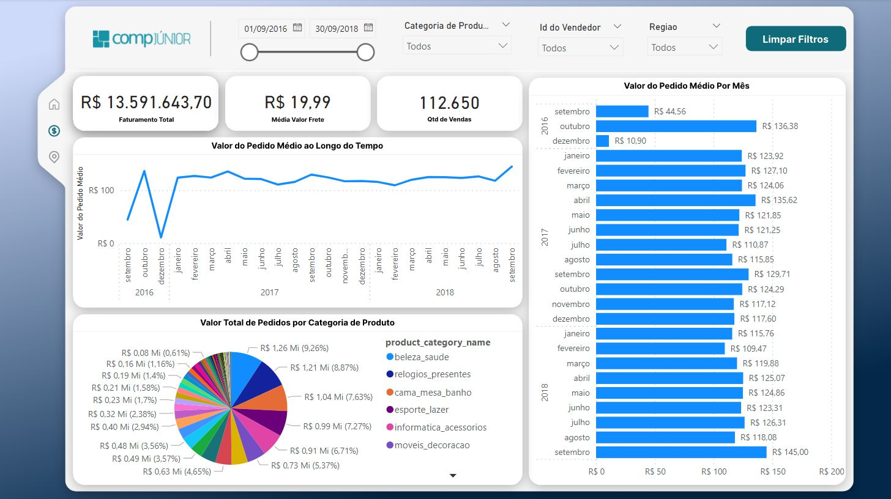
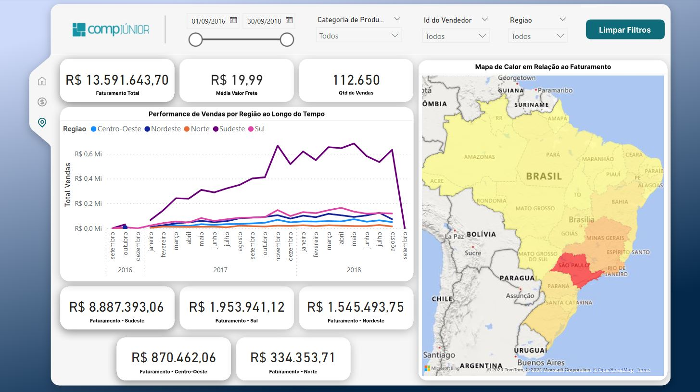

# Projeto Final de Análise de Dados - Thiago Lima

  

 

Este projeto consiste em uma análise de dados reais provenientes de e-commerces brasileiros, disponibilizados pelo Olist, uma plataforma de vendas online que conecta lojistas e marketplaces para vendas de produtos em diversas plataformas.

Para essa análise, foram utilizados Excel e SQL para responder perguntas de negócio, além de Power BI e Python para visualização geral dos dados e análise de padrões e comportamentos.

## Conjuntos de Dados

Os dados utilizados estão distribuídos em oito tabelas principais, contendo informações sobre pedidos, produtos, vendedores, clientes, pagamentos, localizações e reviews de pedidos.

O modelo lógico do banco de dados é apresentado no seguinte formato:

  

## Apresentação

A análise é apresentada em duas frentes:

### Notebook Python:

No notebook encontram-se discussões sobre a distribuição de dados e estratégias de negócio para as empresas, gráficos, análises de padrões e comportamentos, perguntas de negócio e tratamento de dados.

### Confira o notebook Python no arquivo `respostas-pergunta-python.ipynb`.

 

### Dashboard Interativo:

No dashboard encontram-se as principais métricas e indicadores que permitem uma compreensão clara dos dados disponibilizados.

  

  

  

### [Confira aqui a apresentação do dashboard do projeto.](https://youtu.be/_hHypi3FaCk)

 

## Ferramentas

Para a execução dessa análise, foram utilizadas as seguintes ferramentas:

- **Excel**: Para responder perguntas de negócio e agrupar dados, com a criação de uma função personalizada utilizando VBA para tratamento de dados.
- **SQL**: Para responder perguntas de negócio e agrupar dados. As consultas foram estruturadas através do *DBeaver*.
- **Microsoft Power BI**: Para a construção do dashboard do projeto, com a criação de funções em DAX e tabelas auxiliares para a construção das visualizações.
- **Python**: Para realizar a conexão entre tabelas .csv, fazer tratamento de dados, realizar análises e construir gráficos usando bibliotecas como Pandas, Matplotlib, Numpy e Seaborn.   O passo a passo, análises e gráficos estão demonstrados no arquivo `respostas-pergunta-python.ipynb`.

 

## Perguntas de Negócio

#### 1. Qual o total vendido (não considerando o frete) do produto ef92defde845ab8450f9d70c526ef70f?   
O produto ef92defde845ab8450f9d70c526ef70f teve um total de R$ 109,50 em vendas, desconsiderando o frete. O produto foi vendido 5 vezes, com um preço médio de R$ 21,90.

#### 2. Qual o total de vendas no mês de março de 2017 (deconsiderando o frete)?   
O mês de março de 2017 teve um total de R$ 434.494,36 em vendas, desconsiderando o frete. O mês teve 2.751 vendas, com um ticket médio de R$ 157,85.

#### 3. Qual o total de vendas do produto 310ae3c140ff94b03219ad0adc3c778f no mês de Março (em 2017 e em 2018)?   
O produto 310ae3c140ff94b03219ad0adc3c778f teve um total de R$ 0,00 em vendas no mês de março de 2017, e R$ 145,95 em vendas no mês de março de 2018. O produto não foi vendido em março de 2017 e foi vendido uma vez em março de 2018.

#### 4. Qual é o preço médio dos produtos vendidos?  
O preço médio dos produtos vendidos é de R$ 180,41.

#### 5. Quantos produtos diferentes cada vendedor vendeu?  
A resposta detalhada para essa questão pode ser encontrada no arquivo `respostas-pergunta-excel.xslx`, na tabela 'Resposta 7'. Porém, cada vendedor vendeu, em média, 11,1 produtos diferentes.

#### 6. Qual foi o valor total do frete cobrado em 2017?   
O valor total do frete cobrado em 2017 foi de R$ 965.740,28, uma soma de valor do frete de todos os 49.765 pedidos feitos nesse ano.

#### 7.  Identifique o produto mais vendido em termos de quantidade de pedidos.  
O produto mais vendido em termos de quantidade de pedidos foi o produto aca2eb7d00ea1a7b8ebd4e68314663af com um total de 527 vendas.

#### 8. Qual vendedor teve o maior volume de vendas em termos de valor total em 2018?  
O vendedor com o maior volume de vendas em termos de valor total em 2018 foi o vendedor 6fa9202c10491e472dffd59a3e82b2a3, com um total de R$ 480.570,00 em vendas.

#### 9. Qual é a receita total gerada por categoria de produto?  
A resposta detalhada para essa questão pode ser encontrada na pasta `pergunta1` da pasta `Queries SQL`. Porém, as 3 categorias que mais geraram receita foram *beleza_saude*, *relogios_presentes* e *cama_mesa_banho*, nesta ordem.

#### 10. Qual é o tempo médio de entrega dos produtos, por estado?  
A resposta detalhada para essa questão pode ser encontrada no arquivo `TabelaP2.jpg`, que se encontra na pasta `pergunta2` da pasta `Queries SQL`. Porém, os 3 estados com o maior tempo médio de entrega são *Roraima*, *Amapá* e *Amazonas*, nesta ordem, e os 3 estados com o menor tempo médio de entrega são *São Paulo*, *Paraná* e *Minas Gerais*, nesta ordem.

#### 11. Quais são os top 10 clientes em termos de valor gasto (aqueles que gastaram mais)?   
A resposta detalhada para essa questão pode ser encontrada no arquivo `TabelaP3.jpg`, que se encontra na pasta `pergunta3` da pasta `Queries SQL`. Porém, o top 3 em termos de valor gasto, gastaram, respectivamente, R$ 13.664,08, R$ 7.274,88 e R$ 6.929,31.

#### 12. Qual a variação percentual das vendas mensais, comparado ao mês anterior, por categoria?   
A resposta detalhada para essa questão pode ser encontrada na pasta `pergunta4` da pasta `Queries SQL`.

#### 13. Quais os 5 vendedores que têm o maior número de pedidos cancelados?   
A resposta detalhada para essa questão pode ser encontrada no arquivo `TabelaP5.jpg`, que se encontra na pasta `pergunta5` da pasta `Queries SQL`. Porém, os 5 vendedores com o maior número de pedidos cancelados, tiveram, respectivamente, 9, 8, 7, 7 e 7 pedidos cancelados.

#### 14. Quais os estados que tiveram a maior relação “Número de Pedidos”/”Tempo médio de entrega”?  
A resposta detalhada para essa questão pode ser encontrada no arquivo `TabelaP6.jpg`, que se encontra na pasta `pergunta6` da pasta `Queries SQL`. Porém, os 3 estados com a maior relação "Número de Pedidos"/"Tempo médio de entrega" são *São Paulo*, *Minas Gerais* e *Rio de Janeiro*, nesta ordem.
